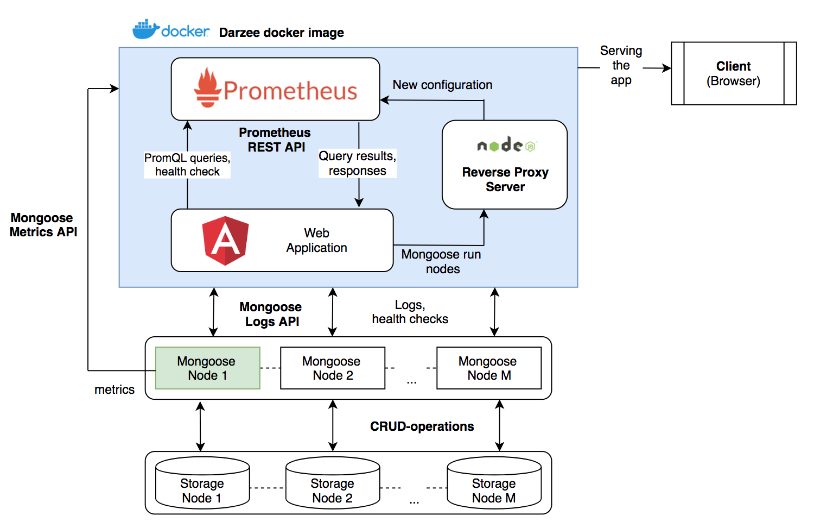
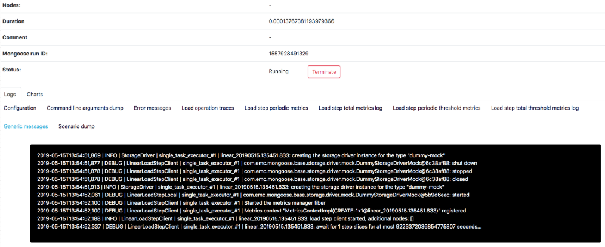

[](https://mongoose-issues.atlassian.net/projects/GUI)
[](https://hub.docker.com/r/emcmongoose/darzee/)
# Darzee
Provides web interface for Mongoose - storage performance testing tool maintained by Dell EMC. 

# Contents 

1. [Overview](#1-overview)<br/>
&nbsp;&nbsp;1.1 [Launch Mongoose run](#11-launch-mongoose-run)<br/>
&nbsp;&nbsp;&nbsp;&nbsp;1.1.1 [Nodes selection](#111-nodes-selection)<br/>
&nbsp;&nbsp;&nbsp;&nbsp;1.1.2 [Configuration](#112-configuration)<br/>
&nbsp;&nbsp;&nbsp;&nbsp;1.1.3 [Scenario](#113-scenario)<br/>
&nbsp;&nbsp;1.2 [Monitoring](#12-monitoring)<br/>
&nbsp;&nbsp;&nbsp;&nbsp;1.2.1 [Mongoose runs table](#121-mongoose-runs-table)<br/>
&nbsp;&nbsp;&nbsp;&nbsp;1.2.2 [Mongoose run statistics](#122-mongoose-run-statistics)<br/>
&nbsp;&nbsp;&nbsp;&nbsp;&nbsp;&nbsp;1.2.2.1 [Mongoose logs](#1221-mongoose-logs)<br/>
&nbsp;&nbsp;&nbsp;&nbsp;&nbsp;&nbsp;1.2.2.2 [Mongoose charts](#1222-mongoose-charts)<br/>
&nbsp;&nbsp;1.3 [Terminate Mongoose run](#13-terminate-mongoose-run)<br/>
2. [Configuration](#2-configuration)<br/>
&nbsp;&nbsp;2.1 [Deploying ports](#21-deploying-ports)<br/>
&nbsp;&nbsp;2.2 [Image versions](#22-image-versions)<br/>
&nbsp;&nbsp;2.3 [Container configuration](#23-container-configuration)<br/>
&nbsp;&nbsp;&nbsp;&nbsp;2.3.1 [Network](#231-network)<br/>
&nbsp;&nbsp;&nbsp;&nbsp;2.3.2 [Prometheus](#232-prometheus)<br/>
&nbsp;&nbsp;2.4 [Other parameters](#24-other-parameters) <br/>
3. [Build and run](#3-build-and-run)<br/>
4. [Deployment](#4-deployment)<br/>
&nbsp;&nbsp;4.1 [Docker](#41-docker)<br/>
&nbsp;&nbsp;4.2 [Kubernetes](#42-kubernetes)<br/>
&nbsp;&nbsp;&nbsp;&nbsp; 4.2.1 [Test Darzee in Kubernetes using predefined Mongoose environment](#421-test-darzee-in-kubernetes-using-predefined-mongoose-environment)<br/>
&nbsp;&nbsp;&nbsp;&nbsp;&nbsp;&nbsp; 4.2.1.1 [Mongoose base](#4211-mongoose-base)<br/>
&nbsp;&nbsp;&nbsp;&nbsp;&nbsp;&nbsp; 4.2.1.2 [Mongoose Pravega driver](#4212-mongoose-pravega-driver)<br/>
5. [Troubleshooting](#5-troubleshooting)<br/>
&nbsp;&nbsp;5.1 [Running Mongoose on localhost (Mac, Windows)](#51-running-mongoose-on-localhost-mac-windows)<br/>
5. [Open issues](#6-open-issues)<br/>
&nbsp;&nbsp;6.1 [Mongoose run logs unavailability](#61-mongoose-run-logs-unavailability)


# 1. Overview 

Darzee lets you configure, run and monitor Mongoose runs. 



## 1.1 Launch Mongoose run

Mongoose launching process is divided in 3 steps: 


### 1.1.1 Nodes selection 


Multiple Mongoose run nodes could be selected. <b>First</b> selected node will be the entry one. <br/>

## 1.1.2 Configuration 


Configuration is presented as an editable JSON tree. <br/>
Initially, the configuration is fetched from the entry node.

## 1.1.3 Scenario 
Mongoose's scenarios are written in JavaScript. It's possible to write JavaScript code in the UI using code editor. 


## 1.2 Monitoring 

### 1.2.1 Mongoose runs table
Discovered Mongoose's runs are displayed within the runs table. 


There's 3 possible status of Mongoose runs: 

808080
	 
	 
*  <b>Finished</b> - means Mongoose run has finished and its logs are available; <br/>
*  <b>Running</b> - means Mongoose is still performing the benchmark. Charts will be updated every time Darzee received a new data; <br/>
*  <b>Unavailable</b> - means info about Mongoose run has been found on the server, but the related data is lost or couldn't be loaded. <br/>

You could see Mongoose run status or run details by pressing the status icon. 


By pressing run status icon, you'll be redirected to run statistics screen. See [Mongoose logs](#1421-mongoose-logs), [Mongoose charts](#1422-mongoose-charts)<br/>.

### 1.2.2 Mongoose run statistics

You're able to check run statistics (logs, charts) of the selected Mongoose run.

 If the run is still being processed, the data will be updating dynamically based on the Mongoose's exported metrics and generated logs. 

#### 1.2.2.1 Mongoose logs 


#### 1.2.2.2 Mongoose charts
Charts are drawn based on Mongoose's exported metrics. There're 4 types of Mongoose charts available:

* <b>duration</b> - mean duration of Mongoose's performed operations;
* <b>bandwidth</b> - amount of processed bytes per second; 
* <b>throughput</b> - shows rate of successful and failed operations performed by Mongoose. It takes mean values for each metric; 
* <b>latency</b> - shows minimal and maximal latency during Mongoose's run; 


## 1.3 Terminate Mongoose run

Processing Mongoose run could be terminated from the UI. 


# 2. Configuration 

UI's configuration depends on the parameters listen within .env file.

## 2.1 Deploying ports 
The following parameters are being used to specify deploying ports of the services: 
 
* DARZEE_PORT - for Darzee itself; 
* PROMETHEUS_PORT - for Prometheus; 
* MONGOOSE_PORT - for Mongoose; 

## 2.2 Image versions 
The following parameters are being used to specify docker image version of a specific service: 
* DARZEE_VER - Darzee's image version; 
* PROMETHEUS_VER - Prometheus image version; 


## 2.3 Container configuration 

### 2.3.1 Network
The following parameters are being used to organize internal network within the container: 

* IMAGES_NETWORK_BRIDGE_BASE_SUBNET - base subnet of container's network; 
* IMAGES_NETWORK_BRIDGE_BASE_SUBNET_SLOTS - amount of slots within the network; 
* PROMETHEUS_IMAGE_IP - *internal (image)* IP of Prometheus within the container; 
* NODE_SERVER_IMAGE_IP - *internal (image)* IP of Node JS server within the container; 

### 2.3.2 Prometheus 
Prometheus configuration is being rewritten in a runtime in order to add targets dynamically. 
To implement this, we're using internal container volume. 
* PROMETHEUS_CONFIGURATION_PATH - full path for Prometheus configuration; 
* PROMETHEUS_CONFIGURATION_FOLDER_PATH - path to Prometheus folder; 

## 2.4 Other parameters 

* MONGOOSE_HOST - specifies host of an initially loaded Mongoose; 

# 3. Build and run 

## 3.1 Build 

### 3.1.1 Build docker image 

Docker image is being builted via Gradle. To build Docker image, use: 
``` 
$ ./gradlew buildImage
```

### 3.1.2 Build project 
Darzee has been created with Angular 7.0. You could build it just like any Angular app. 
```
$ npm install
$ ng build 
```

## 3.2 Run 

### 3.2.1 Run via docker
Darzee is deploying via docker image. The image contains front-end files, nodeJS server to serving the app and Prometheus.
In order to have the access from outside, NodeJS server should be mapped to port 8080 and Prometheus should be mapped to port 9090:
``` 
$ docker run --env-file .env -p 8080:8080 -p 9090:9090 emcmongoose/darzee

```
### 3.2.2 Run in development mode 
Darzee has been created with Angular CLI. It could be ran in development mode using the appropriate command: 
```
$ npm install
$ ng serve 
```

# 4. Deployment 


## 4.1 Docker

Darzee image is being loaded into the [docker hub](https://hub.docker.com/r/emcmongoose/darzee).

```bash
docker run \
    --env-file .env \
    -p {DARZEE_PORT}:{DARZEE_PORT} \
    -p {PROMETHEUS_PORT}:{PROMETHEUS_PORT} \
    emcmongoose/darzee[-<VERSION>] 
```

## 4.2 Kubernetes

Darzee can be deployed in a [kubernetes](https://kubernetes.io/) cluster. Examples of kubernetes object discription files are in the directory `/console/kubernetes`. <br/>
In order to connect with the outside network, Darzee uses Kubernetes service `/console/kubernetes/darzee-service.yml`

Run Darzee as a deployment: <br/>
`$ bash 
kubectl apply -f /console/kubernetes/darzee-deployment.yml` <br/>
`$ bash kubectl apply -f /console/kubernetes/darzee-service.yml` <br/>

### 4.2.1 Test Darzee in Kubernetes using predefined Mongoose environment

The project contains scripts for deploying predefined Mongoose environment in order to run the UI. <br/>
Mongoose's environments are described via Kubernetes deplyoments. Note that there's 2 type of ports for Mongoose: 
* <b>Remote API port</b>. You should specify remote API port when adding it into [nodes list](#111-nodes-selection).
* <b>RMI port</b> (Remote Method Invocation port). You should specify RMI port when adding additional Mongoose nodes in order to run it in distributed mode.
RMI ports should be specified in [configuration](#112-configuration) (load-step-node-addrs).

#### 4.2.1.1 Mongoose base 
```
$ bash cd /console/src/assets/configuration-examples/kubernetes/mongoose-base/tools
$ bash chmod +x  create-mongoose-environment.sh
$ bash ./create-mongoose-environment.sh 
```
This will deploy 2 pods, each of them will contain 5 Mongoose instances. Remote API ports are 9991...9994, 9999, RMI ports are 1091...1094, 1099.
Every one of them are connected to the web outside of k8s cluster via the service. 
You can get service's external IP via 
```
$ bash kubectl get svc mongoose-base-svc
$ bash kubectl get svc mongoose-base-svc-2
```
Combining external IP with Mongoose ports, you'll get an access to it from the network outside of cluster.

In order to delete the environment, use: 
```
$ bash cd /console/src/assets/configuration-examples/kubernetes/mongoose-base/tools
$ bash chmod +x  delete-mongoose-environment.sh
$ bash ./delete-mongoose-environment.sh 
```

#### 4.2.1.2 Mongoose Pravega driver
```
$ bash cd /console/src/assets/configuration-examples/kubernetes/mongoose-pravega/tools
$ bash chmod +x  create-mongoose-pravega-environment.sh
$ bash ./create-mongoose-pravega-environment.sh 
```
This will create a deployment and a service. 
The deployment will contain instance of Mongoose Pravega driver, the service will connect it to the network outside of cluster via port 9999. <br/>
Note that in `/console/src/assets/configuration-examples/kubernetes/mongoose-pravega/mongoose-pravega-service.yml`, you should 
specify a running Pravega controller IP (<b><PRAVEGA_CONTROLLER_IP></b>), otherwise it won't work.
```
args: [--run-node, --storage-namespace=mongoose-pravega-scope, --run-port=9999, --load-step-node-port=1099, 
          --storage-net-node-addrs=<PRAVEGA_CONTROLLER_IP>, --load-batch-size=100, --storage-driver-limit-queue-input=10000]
```

You can get service's external IP via 
```
$ bash kubectl get svc mongoose-pravega-svc
```

In order to delete the environment, use: 
```
$ bash cd /console/src/assets/configuration-examples/kubernetes/mongoose-pravega/tools
$ bash chmod +x  delete-mongoose-pravega-environment.sh
$ bash ./delete-mongoose-pravega-environment.sh 
```


# 5. Troubleshooting 

## 5.1 Running Mongoose on localhost (Mac, Windows)

See [Using Darzee on Mac or Windows](console/supporting-files/windows-and-mac-support).

# 6. Open issues 
We're constantly working on making the UI and Mongoose project overall better. 
In this section, you'd find a list of a high-priority issues that would be fixed as soon as possible.

## 6.1 Mongoose run logs unavailability 
Mongoose run's table is constructed based on the retrieved data from Prometheus: run ID, additional nodes, load step ID, etc. The list doesn't contain entry node address. <br/>
<b>Now</b>: Mongoose run's entry nodes addresses are stored within browser's local storage. It helps to retain the information about entry nodes as long as the local storage not getting cleaned up, yet it'd be saved even if the browser and/or tab has been closed.<br/>
We need entry node's address in order to get logs via POST request with Mongoose Logs API to its entry node. <br/>
<b>Problem</b>: while working outside of the browser from which Mongoose run has been launched (other browser, other computer, etc.), the data about run's entry node is missing, thus logs couldn't be gathered via the Logs API.<br/>

Track progress on the issue [here](https://mongoose-issues.atlassian.net/projects/GUI/issues/GUI-137?filter=allissues).


