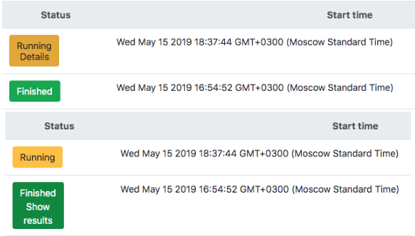
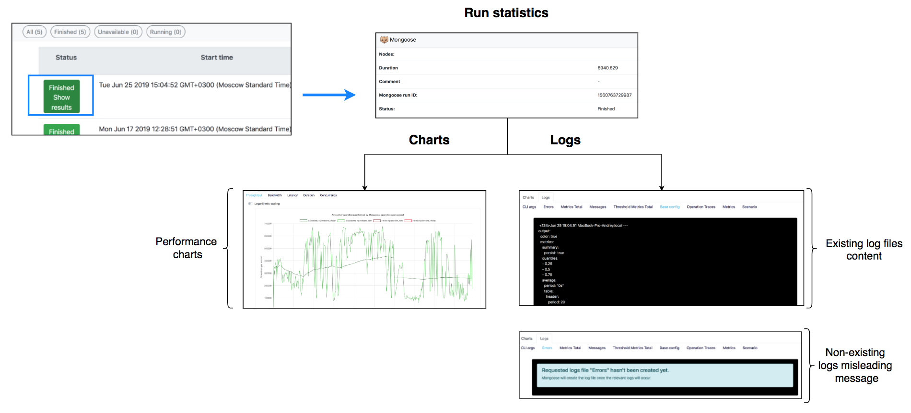

# Mongoose Web UI 
Provides web interface for Mongoose - storage performance testing tool maintained by Dell EMC. 

# Contents 

1. [Overview](#1-overview) 
&nbsp;&nbsp;1.1 [Launch Mongoose run](#11-launch-mongoose-run) 
&nbsp;&nbsp;&nbsp;&nbsp;1.1.1 [Nodes selection](#111-nodes-selection) 
&nbsp;&nbsp;&nbsp;&nbsp;1.1.2 [Configuring](#112-configuring) 
&nbsp;&nbsp;&nbsp;&nbsp;1.1.3 [Scenario](#113-scenario) 
&nbsp;&nbsp;1.2 [Monitoring](#12-monitoring) 
&nbsp;&nbsp;&nbsp;&nbsp;1.2.1 [Mongoose runs table](#121-mongoose-runs-table) 
&nbsp;&nbsp;&nbsp;&nbsp;1.2.2 [Mongoose run statistics](#122-mongoose-run-statistics) 
&nbsp;&nbsp;&nbsp;&nbsp;&nbsp;&nbsp;1.2.2.1 [Mongoose logs](#1221-mongoose-logs) 
&nbsp;&nbsp;&nbsp;&nbsp;&nbsp;&nbsp;1.2.2.2 [Mongoose charts](#1222-mongoose-charts) 
&nbsp;&nbsp;1.3 [Terminate Mongoose run](#13-terminate-mongoose-run) 
2. [Configuration](#2-configuration) 
&nbsp;&nbsp;2.1 [Deploying ports](#21-deploying-ports) 
&nbsp;&nbsp;2.2 [Image versions](#22-image-versions) 
&nbsp;&nbsp;2.3 [Container configuration](#23-container-configuration) 
&nbsp;&nbsp;&nbsp;&nbsp;2.3.1 [Network](#231-network) 
&nbsp;&nbsp;&nbsp;&nbsp;2.3.2 [Prometheus](#232-prometheus) 
&nbsp;&nbsp;2.4 [Other parameters](#24-other-parameters)  
3. [Build and run](#3-build-and-run)
4. [Deploying](#4-deploying)
5. [Troubleshooting](#5-troubleshooting) 
&nbsp;&nbsp;5.1 [Running Mongoose on localhost (Mac, Windows)](#51-running-mongoose-on-localhost-mac-windows) 
5. [Open issues](#6-open-issues) 
&nbsp;&nbsp;6.1 [Mongoose run logs unavailability](#61-mongoose-run-logs-unavailability)

# 1. Overview 

Web UI lets you configure, run and monitor Mongoose. 

## 1.1 Launch Mongoose run

Mongoose launching process is divided in 3 steps: 
* nodes selection; 
* configuration set up; 
* scenario set up; 

### 1.1.1 Nodes selection 

Mongoose could be launched on multiple nodes. You could add and select nodes on the first step of set up. Added nodes will be remained within the UI. 

## 1.1.2 Configuring 

Configuration is being fetched via Mongoose REST API. You could change it via the UI. 
The changed configuration would be passed to Mongoose /run POST request as a parameter. 

## 1.1.3 Scenario 
Mongoose's scenarios are writtign in JavaScript. It's possible to write JavaScript code in the UI using code editor. 

Scenarios could be both loaded and saved into the file system. 

## 1.2 Monitoring 

### 1.2.1 Mongoose runs table
Discovered Mongoose's runs are displayed within the runs table. 

There's 3 possible status of Mongoose runs: 
* Finished - means Mongoose run has finished and its logs are available; 
* Running - means Mongoose is still performing the benchmark and results are not yet available. Althought, some of the details are available; 
* Unavailable - means info about Mongoose run has been found on the server, but the related data is lost or couldn't be loaded. 

You could see Mongoose run status or run details by pressing the status icon. 

By pressing run status icon, you'll be redirected to run statistics screen. See [Mongoose logs](#1421-mongoose-logs), [Mongoose charts](#1422-mongoose-charts) .

### 1.2.2 Mongoose run statistics

You're able to check run statistics (logs, charts) of the selected Mongoose run.

 If the run is still being processed, the data will be updating dynamically based on the Mongoose's exported metrics and generated logs. 

#### 1.2.2.1 Mongoose logs 

#### 1.2.2.2 Mongoose charts
Charts are drawn based on Mongoose's exported metrics. There're 4 types of Mongoose charts available:

* <b>duration</b> - mean duration of Mongoose's performed operations;
* <b>bandwidth</b> - amount of processed bytes per second; 
* <b>throughput</b> - shows rate of successful and failed operations performed by Mongoose. It takes mean values for each metric; 
* <b>latency</b> - shows minimal and maximal latency during Mongoose's run; 

## 1.3 Terminate Mongoose run

Processing Mongoose run could be terminated from the UI. 

# 2. Configuration 

UI's configuration depends on the parameters listen within .env file.

## 2.1 Deploying ports 
The following parameters are being used to specify deploying ports of the services: 
 
* CONSOLE_PORT - for Mongoose Web UI; 
* PROMETHEUS_PORT - for Prometheus; 
* MONGOOSE_PORT - for Mongoose; 

## 2.2 Image versions 
The following parameters are being used to specify docker image version of a specific service: 
* CONSOLE_VER - Mongoose Web UI image version; 
* PROMETHEUS_VER - Prometheus image version; 

## 2.3 Container configuration 

### 2.3.1 Network
The following parameters are being used to organize internal network within the container: 

* IMAGES_NETWORK_BRIDGE_BASE_SUBNET - base subnet of container's network; 
* IMAGES_NETWORK_BRIDGE_BASE_SUBNET_SLOTS - amount of slots within the network; 
* PROMETHEUS_IMAGE_IP - *internal (image)* IP of Prometheus within the container; 
* NODE_SERVER_IMAGE_IP - *internal (image)* IP of Node JS server within the container; 

### 2.3.2 Prometheus 
Prometheus configuration is being rewritten in a runtime in order to add targets dynamically. 
To implement this, we're using internal container volume. 
* PROMETHEUS_CONFIGURATION_PATH - full path for Prometheus configuration; 
* PROMETHEUS_CONFIGURATION_FOLDER_PATH - path to Prometheus folder; 

## 2.4 Other parameters 

* MONGOOSE_HOST - specifies host of an initially loaded Mongoose; 

# 3. Build and run 

## 3.1 Build 

### 3.1.1 Build docker image 

Docker image is being builted via Gradle. To build Docker image, use: 
> $ ./gradlew buildImage

### 3.1.2 Build project 
Mongoose Web UI has been made with Angular 7.0. You could build it just like any Angular app. 
> $ npm install
> $ ng build 

## 3.2 Run 

### 3.2.1 Run via docker-compose 
Mongoose Web UI could be ran via docker compose. 
It'd build a container that contains Mongoose Web UI and Prometheus. Versions of the images are specified within .env file. 
> $ docker-compose up 

### 3.2.2 Run in development mode 
Mongoose Web UI has been build with Angular CLI. It could be ran in development mode using the appropriate command: 
> $ npm install
> $ ng serve 

# 4. Deploying 

Mongoose image is being loaded into the [docker hub](https://hub.docker.com/r/emcmongoose/mongoose-console).

* It's possible to push Docker image to docker hub via gradle: 
> $ docker login
> $ ./gradlew pushImage 

# 5. Troubleshooting 

## 5.1 Running Mongoose on localhost (Mac, Windows)

See [Using Mongoose Web UI on Mac or Windows](console/supporting-files/windows-and-mac-support).

# 6. Open issues 
We're constantly working on making the UI and Mongoose project overall better. 
In this section, you'd find a list of a high-priority issues that would be fixed as soon as possible.

## 6.1 Mongoose run logs unavailability 
Mongoose run's table is constructed based on the retrieved data from Prometheus: run ID, additional nodes, load step ID, etc. The list doesn't contain entry node address.  
<b>Now</b>: Mongoose run's entry nodes addresses are stored within browser's local storage. It helps to retain the information about entry nodes as long as the local storage not getting cleaned up, yet it'd be saved even if the browser and/or tab has been closed. 
We need entry node's address in order to get logs via POST request with Mongoose Logs API to its entry node.  
<b>Problem</b>: while working outside of the browser from which Mongoose run has been launched (other browser, other computer, etc.), the data about run's entry node is missing, thus logs couldn't be gathered via the Logs API. 

Track progress on the issue [here](https://mongoose-issues.atlassian.net/projects/GUI/issues/GUI-137?filter=allissues).

